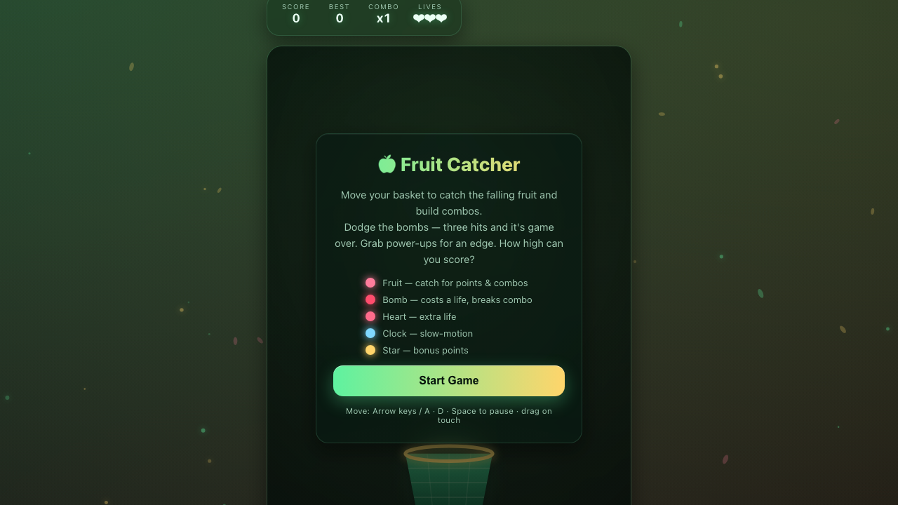

# 🍎 Fruit Catcher

Move your basket left and right to catch falling fruit, build juicy combos, dodge bombs, and grab power-ups — a cozy arcade catch game with a dark animated orchard vibe.

🎮 **Play Online:** https://gamelabz.github.io/html5-game-fruit-catcher/

## 📸 Screenshot



## 🎯 About

**Fruit Catcher** is a modern, dependency-free HTML5 game. Slide your glowing basket across the bottom of the screen to collect fruit. Every fruit you catch builds your **combo**, multiplying your score, but a missed fruit breaks the streak. Bombs cost a life and shatter your combo — catch three bombs and the game ends. Occasional power-ups (extra life, slow-motion, golden bonus) keep runs exciting. Your best score is saved locally, so you can always chase a new record.

## 🕹️ Controls

- **Move basket:** `←` / `→` arrow keys or `A` / `D`
- **Pause / Resume:** `Space` or `Enter`
- **Touch / Mouse:** press and drag horizontally across the play area

## ✨ Features

- 🍎 Catch fruit to score and build **combos** for bigger multipliers
- 💣 Dodge **bombs** — each costs a life and breaks your combo
- ❤️ Occasional **power-ups**: extra life, slow-motion, and golden bonus fruit
- 🌟 3 lives with a persistent **best score** via `localStorage`
- 🌌 Dark animated gradient orchard background with glowing, glassmorphic HUD
- ✨ Fall particles, floating score popups, screen shake, and ambient fireflies
- 📱 Fully responsive — plays great on desktop, tablet, and phone
- 🚫 Zero dependencies, no frameworks, no CDNs — pure vanilla JavaScript

## 🚀 Run Locally

No installation required. Open the game directly in a browser:

```bash
# Option A: just open the file
open index.html

# Option B: serve it with a tiny static server
npx serve .
```

Then visit the printed URL (default `http://localhost:3000`).

## 🛠️ Tech Stack

- HTML5 `<canvas>`
- CSS3 (custom properties, flexbox, glassmorphism)
- Vanilla JavaScript (ES2020, no frameworks)

## 🤝 Contributing

Contributions are welcome! To contribute:

1. Fork the repository.
2. Create a feature branch (`git checkout -b feature/my-idea`).
3. Commit your changes (`git commit -m "Add my idea"`).
4. Push to the branch (`git push origin feature/my-idea`).
5. Open a Pull Request.

Please keep the game dependency-free and test it in your browser before submitting.

## 📄 License

This project is licensed under the [MIT License](LICENSE) — a free and open-source license.

---

Let's Build Something Together 🚀
https://tally.so/r/q4q1L9
